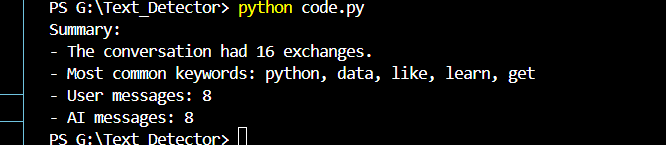
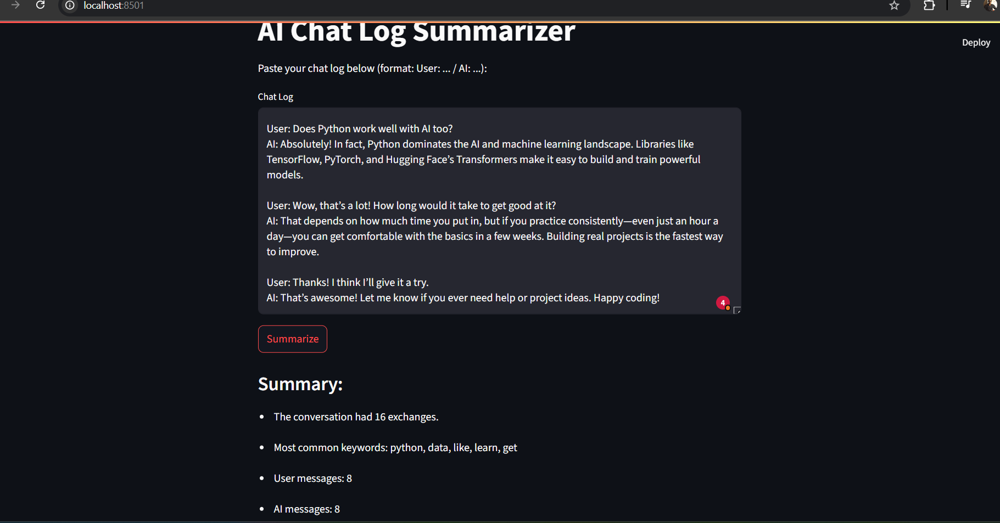

# AI Chat Log Summarizer

This Python project reads a chat log between a user and an AI (formatted as `User:` and `AI:` lines), analyzes the conversation, and prints a summary. The summary includes the total number of exchanges, message counts for each speaker, and the most common keywords (excluding common stop words). You can use it from the command line or with a user-friendly Streamlit web interface.

---

## Features

- Parses chat logs and separates messages by speaker (User or AI)
- Counts total messages and messages per speaker
- Extracts the top 5 most frequent keywords (ignoring common stop words)
- Provides a summary of the conversation
- Streamlit web interface for easy use

---

## How the Code Works

1. **Parsing:** Reads the chat log and separates messages by speaker.
2. **Statistics:** Counts the total number of messages and how many were sent by each speaker.
3. **Keyword Extraction:** Finds the top 5 most frequent keywords, ignoring common English stop words.
4. **Summary:** Prints or displays a summary with all the above information.

---

## How to Run (Command Line)

1. Place your chat log (e.g., `chat.txt`) in the same folder as the script. The chat log should look like:
    ```
    User: Hello!
    AI: Hi! How can I assist you today?
    User: Can you explain what machine learning is?
    AI: Certainly! Machine learning is a field of AI that allows systems to learn from data.
    ```
2. Make sure you have Python installed.
3. Install the required libraries:
    ```
    pip install nltk
    ```
4. Run the script:
    ```
    python [code.py](http://_vscodecontentref_/1)
    ```
5. The summary will be printed in the terminal.

---

## How to Run (Streamlit Web App)

1. Install the required libraries:
    ```
    pip install nltk streamlit
    ```
2. Run the Streamlit app:
    ```
    streamlit run code.py
    ```
3. A browser window will open. Paste your chat log into the text area and click **Summarize** to see the summary.

---

## Example Output

### Terminal Output



### Streamlit Web App



---

## Requirements

- Python 3.11
- nltk
- streamlit (for web interface)

---


## Author

Chinmoy Mitra
